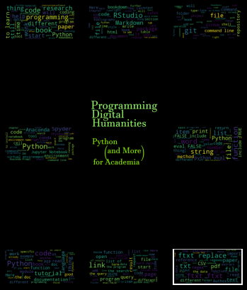

# Programming Digital Humanities. Python (and More) for Academia: Getting Started with the GitHub Repo

This is the repo for my book **Programming Digital Humanities. Python (and More) for Academia**. You can download the book in your favourite format from [LeanPub](https://leanpub.com/programming-digital-humanities-python-for-academia).

The idea of the book is to provide a gentle introduction to programming for academics outside Computer Science/Math and for curious people in general, without disappointing this curiosity. The hard task is that of combining:

1. *technical accuracy*: **whys** should be understood. It's academia, research, and Humanities after all. That means avoid black boxes and a copy-paste approach when it comes to learning how to code;
2. *interesting learning*: again, it's Humanities. Pedagogy (and gamification) matter: the book while being academic should not be boring and provide too many details you don't understand. Theory says it should be fun;
3. *relevance*: academics are busy. Interdisciplinarity is hard when it requires to learn new things. We want to understand the theoretical *whys* but also have a chance to practically appreciate why we may delve into some code. The challenge is to keep it practical and showing the relevance of the various programming things for academia and humanities. There's a further constraint: we have to **use the resource we are learning** (so, nope, no "there's a super cool deep learning model that writes poems" nor machine translation);
4. *going from reading to doing*: as with all languages, we are not going to be fluent only by reading books. While doing all the above we need to find a way to apply the things we learn and try it in the real world. The key is that of prompting a self-exploring attitude. Exercises are an option, but we think they are boring. 

Ok, enough of paradoxes. This is all too hard and I still haven't set on a recipe. Plus, write while learning more makes it harder to settle on something stable. This is an evolving and breathing book, so it's perfect for GitHub.

Anyway, **narration** is a great tool and I've set it up. We have a shared or familiar endeavor (academia and research) and we start from there. Both fictionally (read the [intro](https://github.com/1110sillabo/ProgrammingDigitalHumanitiesBook/blob/master/Ch1%20-%20Intro/index.md)) and practically.

The point of having the whole book (in progress) out here serves more goals besides showing that GitHub and programming are useful in the Humanities. This is also a learning report.

## How to View the Files / Issues with the Text

The chapters are written in RMarkdown and the book is meant to be compiled as an R Bookdown project. [Here's an intro on Markdown in general](https://medium.com/analytics-vidhya/getting-started-with-markdown-and-rstudio-f75b1dff0796), or you can read [Chapter 2 of the book](https://github.com/1110sillabo/ProgrammingDigitalHumanitiesBook/blob/master/Ch2%20-%20RStudio%20and%20Markdown/01_gettingstartewithRStudio_gitversion.md).

GitHub renders Markdown files automatically (**how cool!**). Unfortunately, GitHub is used primarily to share code and not books about code. It renders Markdown (.md) and not RMarkdown (.Rmd) files.

This is a minor issue. The whole content of the book is still there. Practically it means that:

- cross-references between chapters are not going to be displayed. Imagine there's a link every time you see some for of \@ syntax (if you come from Latex, that  will look familiar);
- footnotes are not rendered correctly (unfortunately RMarkdown and Git Markdown have different syntax for that). So, every time you see a caret (**^**) and square brackets it's a footnote. Example:^[This is a footnote].

## Links

You can click on the links that are displayed. If you have visual issues with links showed in their extended form and not as 'here' (with link working once clicked) remember that the book is also meant to be read. And with ebooks or real book the link is not an information that can be hidden.

# Feedback and Open Issues

Am I doing things right? Is something I am missing in the description of academia? Is there more I should add?

(Besides that, the issue of *does my code suck* is always something a public repo help addressing. Yes, there will be code.)

So feel free to peak at the [intro](https://github.com/1110sillabo/ProgrammingDigitalHumanitiesBook/blob/master/Ch1%20-%20Intro/index.md) and send feedback both here (the GitHub way) and with more academia-like methods. 

## Pictures and Photos

I went light on photos and pictures. I can't make up my mind on that. Are they needed or not? Can they guide? I kind of expect them on tutorials, but I find them boring in books.